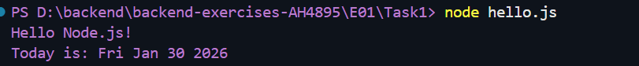
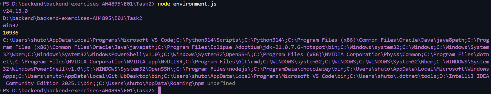
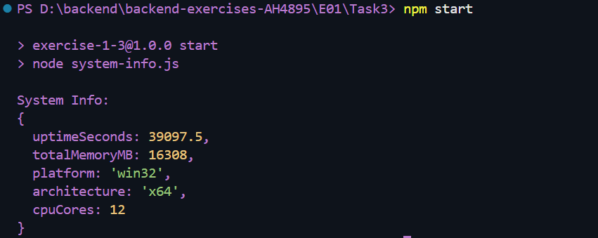
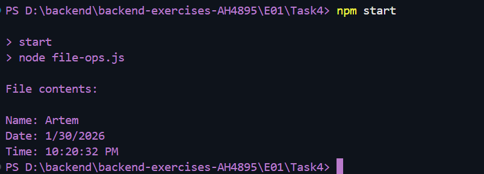
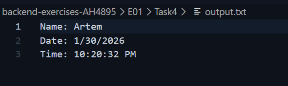
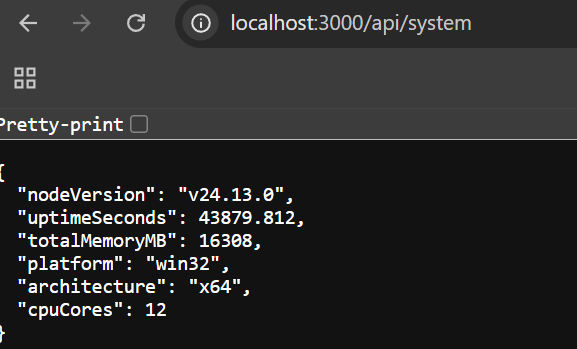
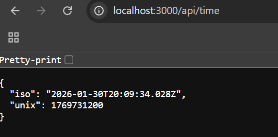

# Exercise set 01

## Task 1

Installed Node.js and verified installation with `node -v` and `npm -v`. Created `hello.js` and ran `node hello.js`.

## Task 2

Created `environment.js` and displayed environment information using `process`. Ran `node environment.js`.

## Task 3

Created `package.json` with ES modules. Created `system-info.js` using the `os` module. Ran `npm start`.

## Task 4

Created `file-ops.js` using `fs/promises`. Created `output.txt`, wrote data, and read file contents. Ran `npm start`.

## Task 5

Created HTTP server with routes `/`, `/api/system`, and `/api/time`. Started server with `node server.js` and tested routes in browser.

